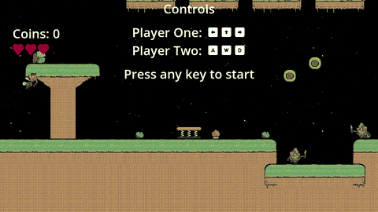
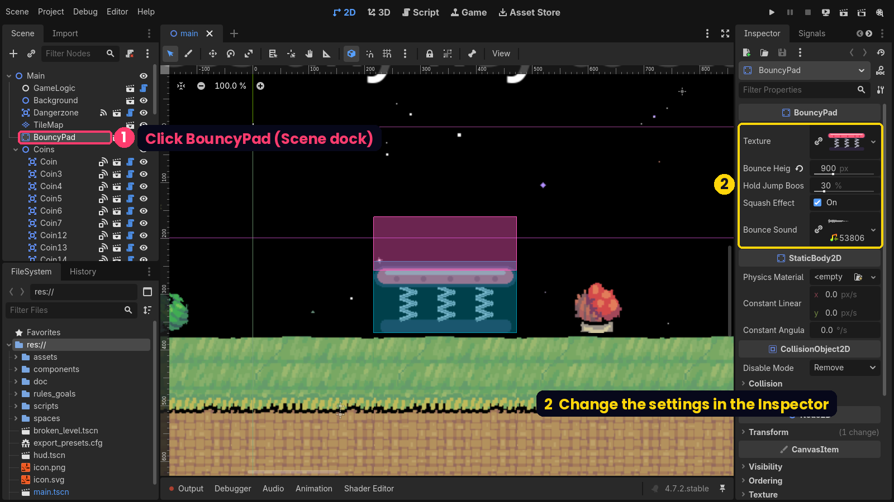
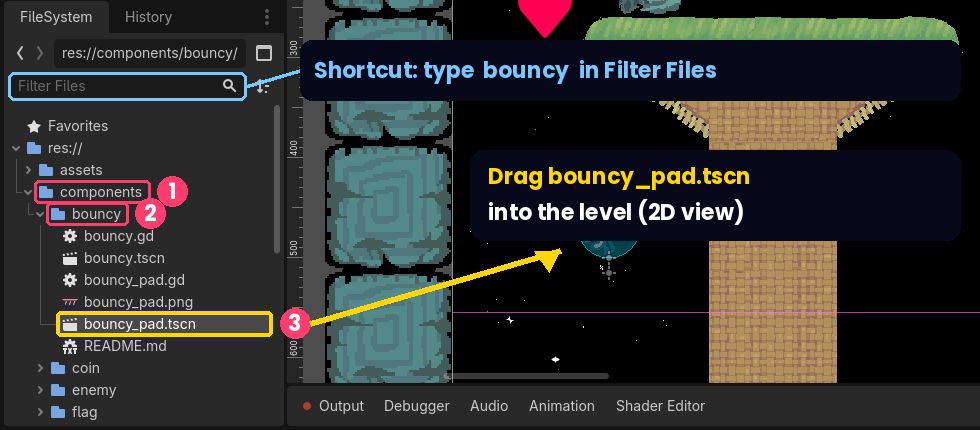
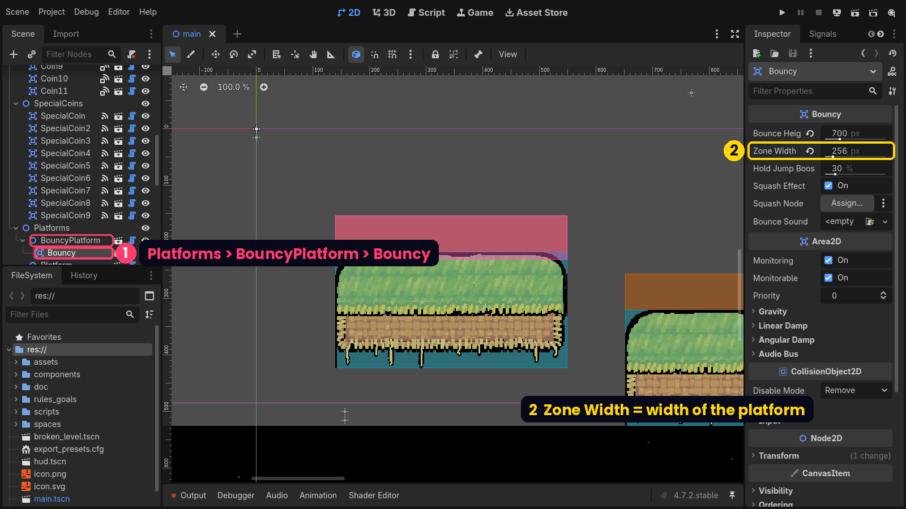

# Moddable Platformer + Bouncy

**Next-Gen Summit 2026 · Game modding with Godot — no install needed**



This repository contains a version of the **Moddable Platformer** game with a new **Bouncy** asset added. Students open it in the free Godot web editor, play it in the browser, and change how the game works — no installation and no coding required.

### 🔗 Links

| | |
|---|---|
| **Godot Web Editor** (open this in Chrome or Edge) | **https://editor.godotengine.org/releases/latest/** |
| **Download the game project** (includes Bouncy) | [`moddable-platformer-bouncy.zip`](https://github.com/yche1364-YJ/Next-Gen-Summit-2026/raw/main/moddable-platformer-bouncy.zip) |
| Bouncy asset only (for a project you already started) | [`bouncy-asset.zip`](https://github.com/yche1364-YJ/Next-Gen-Summit-2026/raw/main/bouncy-asset.zip) |
| 🕹️ **Game Gallery** (play everyone's games) | **https://yche1364-yj.github.io/Next-Gen-Summit-2026/** |
| 📤 **Submit your game** | [How to submit](SUBMIT.md) · [Submission form](https://github.com/yche1364-YJ/Next-Gen-Summit-2026/issues/new?template=submit-game.yml) |
| Teachers | [Teacher guide](TEACHER-GUIDE.md) |
| Original project | https://github.com/endlessm/moddable-platformer |
| Godot web editor documentation | https://docs.godotengine.org/en/stable/tutorials/editor/using_the_web_editor.html |

---

## Contents

- [Where this project comes from](#where-this-project-comes-from)
- [What's in this repository](#whats-in-this-repository)
- [Quick start: open the game in your browser](#quick-start-open-the-game-in-your-browser)
- [Using the Bouncy asset](#using-the-bouncy-asset)
- [Customizing the Bouncy asset](#customizing-the-bouncy-asset)
- [Challenges to try](#challenges-to-try)
- [How it works](#how-it-works)
- [Using Bouncy in another Godot project](#using-bouncy-in-another-godot-project)
- [Troubleshooting](#troubleshooting)
- [Credits and license](#credits-and-license)

---

## Where this project comes from

This project is **based on [endlessm/moddable-platformer](https://github.com/endlessm/moddable-platformer)**, a mini moddable platform game made by [Endless Access](https://endlessaccess.org) to make it easier to start learning Godot. All credit for the original game, art, sounds and level goes to Endless Access.

- **Original repository:** https://github.com/endlessm/moddable-platformer
- **Version used:** `main` branch, commit [`3e793f5`](https://github.com/endlessm/moddable-platformer/commit/3e793f53598a131c53fb82555191cc14b8db07ff) (August 2026)
- **Original license:** MIT (see [`LICENSE`](LICENSE))
- **Godot version:** 4.7 (GL Compatibility renderer, which is what the web editor uses)

**What we added on top of the original:**

| Added | Description |
|---|---|
| `components/bouncy/bouncy_pad.tscn` | A ready-made **trampoline** you can drag into any level |
| `components/bouncy/bouncy.tscn` | A **Bouncy component** that makes *any* object bouncy |
| `components/bouncy/bouncy_pad.png` | The default trampoline picture (replace it with your own!) |
| `components/bouncy/README.md` | Short instructions inside the project |
| `main.tscn` *(changed)* | The main level now **already contains a trampoline (`BouncyPad`) and a bouncy platform (`Platforms/BouncyPlatform`)**, so you can see and edit them as soon as you open the project |

Apart from those two new nodes in `main.tscn`, **none of the original game files were changed**, so everything from the original project — including its own mods described in `doc/MODS.md` — still works exactly the same.

---

## What's in this repository

| File / folder | What it is |
|---|---|
| [`moddable-platformer-bouncy.zip`](moddable-platformer-bouncy.zip) | **The complete game project with Bouncy.** This is the file you load into the web editor. |
| [`SUBMIT.md`](SUBMIT.md) | How students submit their finished game |
| [`TEACHER-GUIDE.md`](TEACHER-GUIDE.md) | How teachers approve submissions and run the gallery |
| [`submissions/`](submissions/) | Accepted games (added automatically) |
| [`tools/`](tools/), [`gallery/`](gallery/), [`.github/`](.github/) | The submission form and the automation that builds the gallery website |
| [`bouncy-asset.zip`](bouncy-asset.zip) | **Just the Bouncy asset**, to add it to a project you already started ([how](#no-bouncy-folder-add-it-to-your-project)) |
| [`bouncy-asset/`](bouncy-asset/) | The Bouncy asset's source files, so you can read the code on GitHub |
| [`images/`](images/) | Screenshots and the demo animation used in this README |
| [`LICENSE`](LICENSE) | License (MIT) |

---

## Quick start: open the game in your browser

### Before you start

- Use **Chrome or Edge on a laptop or desktop computer**. Tablets and phones are not supported well.
- You don't need to install anything or create an account.
- **Important:** the web editor saves your project **inside your browser**, not in a normal folder. If you clear your browsing data, use a different computer, or use a private/incognito window, your project will not be there. See [Step 5](#step-5-save-your-work) for how to save your work.

### Step 1: Download the project

Download **[`moddable-platformer-bouncy.zip`](https://github.com/yche1364-YJ/Next-Gen-Summit-2026/raw/main/moddable-platformer-bouncy.zip)**.

Keep it as a ZIP — **do not unzip it.**

### Step 2: Open the Godot web editor

1. Go to **https://editor.godotengine.org/releases/latest/**
2. A notice about the web editor's limitations appears. Click **OK - Don't Show Again**.
3. Next to **Preload project ZIP**, click **Choose File** and select `moddable-platformer-bouncy.zip`.
4. Click **Start Godot Editor**. Loading takes about 10–30 seconds.

### Step 3: Install the project

An **Install Project** window appears.

1. *(Optional)* Change the **Project Name** from `Preload` to something you'll recognize, such as `my-bouncy-game`. The project path updates to match.
2. Leave **Edit Now** ticked.
3. Click **Install** — **only once**. It can take a few seconds to finish.

The project opens in the editor.

> **Tip:** if the window says *"The selected path is not empty"*, a project with that name already exists in this browser. Just type a different project name.

### Step 4: Play the game

1. The editor starts in the **3D** view, which looks empty. Click **2D** at the top of the screen to see the level (`main.tscn`). You can already see the **pink trampoline** on the ground.
2. Click the **▶ Run Project** button (top right), or press **F5**.
3. The game appears in the **Game** tab. **Click once on the game** so it receives your keyboard, then press any key to start.
4. Walk right, jump onto the pink trampoline, and bounce! Land on the floating platform above to keep bouncing.

| | Move | Jump |
|---|---|---|
| **Player One** | ← → arrow keys | ↑ arrow key |
| **Player Two** | A / D | W |

To go back to editing, click the **Editor** tab at the top. Click the **■ Stop** button (top right) to stop the game.

### Step 5: Save your work

Because your project lives inside the browser, **download a copy at the end of every session**:

1. In the editor, open the **Project** menu → **Tools** → **Download Project Source**.
2. A ZIP file of your project is downloaded to your computer.

**To continue next time:** open the web editor again and load *your* downloaded ZIP with **Preload project ZIP** (Step 2), instead of the original one.

### Step 6: Submit your finished game

When your game is finished, one person per team submits the ZIP with the online form. After your teacher approves it, your game appears in the **[Game Gallery](https://yche1364-yj.github.io/Next-Gen-Summit-2026/)**, where anyone can play it in the browser — that's where we'll play all the games on presentation day.

👉 **[How to submit your game](SUBMIT.md)** (includes how to create a GitHub account)

---

## Using the Bouncy asset

### Where is the Bouncy Pad?

> ⚠️ **The Godot web editor starts empty.** The Bouncy asset is **inside our game project**, not in the editor and not in the **Asset Store**. You only see it after loading **`moddable-platformer-bouncy.zip`** (see [Quick start](#quick-start-open-the-game-in-your-browser)).

**It's already in the level.** When the project opens, the main level (`main.tscn`) already has a trampoline and a bouncy platform. To edit them:

- **In the Scene dock** (top left), click **`BouncyPad`** (near the top, just below `TileMap`) — or click the pink trampoline in the 2D view.
- For the bouncy platform, expand **`Platforms`** → **`BouncyPlatform`** and click **`Bouncy`**.
- Their settings appear in the **Inspector** on the right (see [Customizing the Bouncy asset](#customizing-the-bouncy-asset)).



**Want more trampolines?** Select `BouncyPad` and press **Ctrl+D** (**Cmd+D** on Mac) to duplicate it, then drag the copy somewhere else. Or drag a new one in from the **FileSystem** dock (bottom left): open **`components`** → **`bouncy`** and **drag `bouncy_pad.tscn` into the level**:



**Shortcut:** type `bouncy` in the **Filter Files** box at the top of the FileSystem dock.

#### No `bouncy` folder? Add it to your project

If there's no `components/bouncy` folder, you loaded the **original** Moddable Platformer instead of our version. You don't have to start over:

1. Download **[`bouncy-asset.zip`](https://github.com/yche1364-YJ/Next-Gen-Summit-2026/raw/main/bouncy-asset.zip)** and **unzip it** on your computer. You get a folder called **`bouncy`**.
2. In the Godot web editor, **drag the `bouncy` folder** from your computer onto the **`components`** folder in the FileSystem dock.
3. Check that you now have `components/bouncy/bouncy_pad.tscn`. Done!

> The folder must end up exactly at `components/bouncy/` — the files expect that location.

There are two ways to make things bouncy:

| | **Option 1: Bouncy Pad** | **Option 2: Bouncy component** |
|---|---|---|
| File | `components/bouncy/bouncy_pad.tscn` | `components/bouncy/bouncy.tscn` |
| What it is | A ready-made trampoline | A bounce zone you attach to **any** object |
| Good for | Getting started quickly | Making platforms, enemies, rocks… bouncy |

### Option 1: Add a trampoline (Bouncy Pad)

1. Open a level, for example `main.tscn`, and make sure you're in the **2D** view.
2. Duplicate the existing `BouncyPad` (**Ctrl+D**), **or** drag `components/bouncy/bouncy_pad.tscn` from the FileSystem dock into the level.
3. Move it so it **sits on the ground**. The trampoline's origin (the point you drag) is at the **bottom-centre** of the picture.
4. With the trampoline selected, change its settings in the **Inspector** on the right.
5. Press **F5** to test it.

*In the editor, the pink box is the bounce zone and the blue box is the solid part you can stand on. All the settings you need are at the top of the Inspector.*

### Option 2: Make any object bouncy (Bouncy component)

1. In the **Scene** dock (top left), **right-click** the object you want to make bouncy — for example one of the `Platform` nodes — and choose **Instantiate Child Scene**.
2. Pick `components/bouncy/bouncy.tscn`. A new **Bouncy** node appears under your object.
3. Move the Bouncy node to the object's **top surface**. The **pink box** should stick out slightly above the surface. For a Platform, set the Bouncy node's **Position y** to **-64**.
4. Make the pink box **as wide as the object**: in the Inspector, set **Zone Width**. A Platform is **128 px per tile**, so a Platform with `Width` 2 needs **256**.
5. Change the other settings in the **Inspector**.
6. Press **F5** to test.



*In the main level, `Platforms/BouncyPlatform` has a `Bouncy` child with Zone Width 256. The pink bounce zone covers the platform's whole top surface.*

> **Tip:** you can attach Bouncy to almost anything — a platform, a sign, the flag, even an enemy. The player bounces whenever they land on the pink zone from above.

---

## Customizing the Bouncy asset

### Settings in the Inspector

| Setting | What it does | Default | Bouncy Pad | Bouncy component |
|---|---|---|:-:|:-:|
| **Bounce Height** | How high the player is launched, **in pixels**. For comparison, a normal jump is about **395 px**. | 600 (in the level: 900 for the pad, 700 for the platform) | ✓ | ✓ |
| **Zone Width** | How wide the pink bounce zone is, in pixels. Make it as wide as the object. | 128 | (automatic) | ✓ |
| **Hold Jump Boost** | Extra height (in %) if the player is holding the jump key when they land. Set to 0 to turn it off. | 30% | ✓ | ✓ |
| **Squash Effect** | Squashes and stretches the picture when someone bounces on it. | On | ✓ | ✓ |
| **Squash Node** | Which node gets squashed. If empty, the Bouncy node's parent is squashed. | (parent) | — | ✓ |
| **Bounce Sound** | Sound played on each bounce. The pad uses the game's "boing" sound. | boing / none | ✓ | ✓ |
| **Texture** | The trampoline's picture. | Pink trampoline | ✓ | — |

Because **Bounce Height** is measured in pixels, you can look at the ruler at the top/left of the 2D view to see exactly how high the player will go.

### Change the trampoline's picture

1. Draw or find a **PNG** image. Good guidelines:
   - Around **64–256 pixels wide** (the default is 128 × 64).
   - A **transparent background**.
   - **No empty space around the edges** — the solid area is the whole picture, so empty margins become invisible walls.
   - Draw it the way it should sit on the ground; the bottom edge of the picture is placed on the floor.
2. **Drag the PNG file from your computer into the FileSystem dock** in the editor (the `components/bouncy/` folder is a good place).
3. Select your trampoline in the level.
4. **Drag the PNG from the FileSystem dock onto the Texture field** in the Inspector.

The solid area and the bounce zone **resize automatically** to fit your picture. To go back to the original, right-click the Texture field → **Clear**.

> You can have many trampolines with different pictures and heights in the same level — each one has its own settings.

### Change the sound

- **Different sound:** drag an `.ogg` or `.wav` file into the FileSystem dock, then drag it onto the **Bounce Sound** field. The game's existing sounds are in `assets/sounds/`.
- **No sound:** right-click the **Bounce Sound** field → **Clear**.

### Change how the Bouncy component looks or works on an object

- **Wider/narrower bounce zone:** change **Zone Width** in the Inspector.
- **Squash only part of an object:** set **Squash Node** to the picture (for example a `Sprite2D`) instead of the whole object.
- **No squash:** untick **Squash Effect**. This is a good idea on large objects or on platforms that move.

---

## Challenges to try

1. **Match the jump:** set Bounce Height to **395**. Does the bounce now feel exactly like a normal jump?
2. **Gravity experiment:** select **GameLogic** in `main.tscn` and lower its **Gravity**. Bounce again. The bounce height stays the same — but how does it *feel*? (Hint: you float longer.)
3. **Reach the secret coin:** there's a coin floating high above the start of the level. Place trampolines so the player can reach it without the falling platforms.
4. **Bounce chain:** build a path where the player has to bounce from pad to pad without touching the ground.
5. **Super bounce only:** set a pad's Bounce Height low (for example 200) and Hold Jump Boost high (for example 200%). Now the player *must* hold jump to get over the obstacle.
6. **Make your own design:** draw a mushroom, a jelly, a spring or a cloud and use it as your trampoline's picture.
7. **Bouncy enemy:** attach the Bouncy component to an enemy. What changes about the game?

---

## How it works

*(For anyone curious about the code — you don't need this to use the asset.)*

The **Bouncy component** (`bouncy.gd`) is an **Area2D**, an invisible detection zone (the pink box). When a player enters the zone **while falling onto it from above**, the script changes the player's vertical speed so they fly upwards:

```gdscript
character.velocity.y = -sqrt(2.0 * gravity * height)
```

This is the physics formula **v = √(2gh)**: the starting speed you need to reach height *h* when gravity is *g*. That's why you only type a *height* — the script works out the speed for you, using the game's current gravity. (In Godot, negative *y* means "up".)

A few details that make it feel right:

- It only bounces players who are **moving down** and are **above** the zone, so jumping up through a one-way platform or bumping into its side does nothing.
- The original Player script briefly stops gravity right after touching the ground ("coyote time"); Bouncy resets that timer so the bounce height is accurate.
- After each bounce it emits a `bounced` signal, which other scripts can connect to (for example to count bounces or play an effect).

The **Bouncy Pad** (`bouncy_pad.gd`) is a solid **StaticBody2D** with a picture and a Bouncy component inside. Whenever you change its Texture, it measures the picture and resizes its collision shape and bounce zone to match.

Both scripts are short and fully commented — open them from `components/bouncy/` in the editor (or read them in [`bouncy-asset/`](bouncy-asset/)).

We tested the bounce height with automated tests in Godot 4.7.2: the measured height is within about 2% of the Bounce Height setting (including with changed gravity and with the hold-jump boost).

---

## Using Bouncy in another Godot project

The files in [`bouncy-asset/`](bouncy-asset/) are written for **this** game. To use them in a different Godot 4 project:

1. Copy them into your project at **`res://components/bouncy/`** (the scenes refer to that path).
2. Make sure your player is a **CharacterBody2D** in the **`players`** group.
3. `bouncy.gd` uses two things from this game that you'll need to replace:
   - `Global.PhysicsLayers.PLAYER` — replace it with your player's physics layer number.
   - `Actions.lookup(character.player, "jump")` — replace it with your jump action name, for example `"ui_accept"`.
4. `bouncy_pad.tscn` uses the sound `res://assets/sounds/538066__stevielematt__boing.ogg`; point it to your own sound or clear it.

---

## Troubleshooting

| Problem | Solution |
|---|---|
| The editor won't start or shows a warning about missing features | Use an up-to-date **Chrome or Edge** on a computer. |
| A long warning listing files that *"failed extraction from package"* appears | You probably clicked **Install** twice. Click OK; the project from the first click is fine. |
| *"The selected path is not empty"* | Change the **Project Name** in the Install window to a new name. |
| The editor shows an empty 3D grid | Click **2D** at the top of the screen. |
| The keyboard doesn't control the player | Click once on the game picture first. |
| I can't find the Bouncy Pad | It's in `components/bouncy/` — see [Where is the Bouncy Pad?](#where-is-the-bouncy-pad) |
| The player doesn't bounce on my object | Make sure the pink box is on the **top** surface and sticks out a little above it, and that it's as wide as the object. |
| My project disappeared | It was stored in the browser. Load your last **Download Project Source** ZIP using Preload project ZIP. |
| My custom picture has invisible walls | Crop the empty transparent space around the picture. |

---

## Credits and license

- **Original game:** [Moddable Platformer](https://github.com/endlessm/moddable-platformer) by **[Endless Access](https://endlessaccess.org)**, released under the **MIT License** — Copyright 2024–2025 Endless Access. The original game's code, art, sounds and level are unchanged and remain the work of Endless Access and the asset creators credited in that project.
- **Bounce sound:** the trampoline reuses the "boing" sound already included in the original project (`assets/sounds/538066__stevielematt__boing.ogg`, from Freesound).
- **Bouncy asset** (Bouncy component, Bouncy Pad, trampoline picture, and the trampoline and bouncy platform added to the main level): created for **Next-Gen Summit 2026** and shared under the same **MIT License**.
- **Godot Engine:** https://godotengine.org

See [`LICENSE`](LICENSE) for the full license text.
